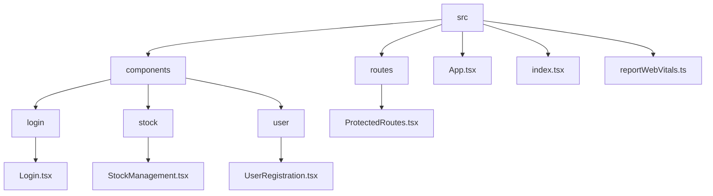
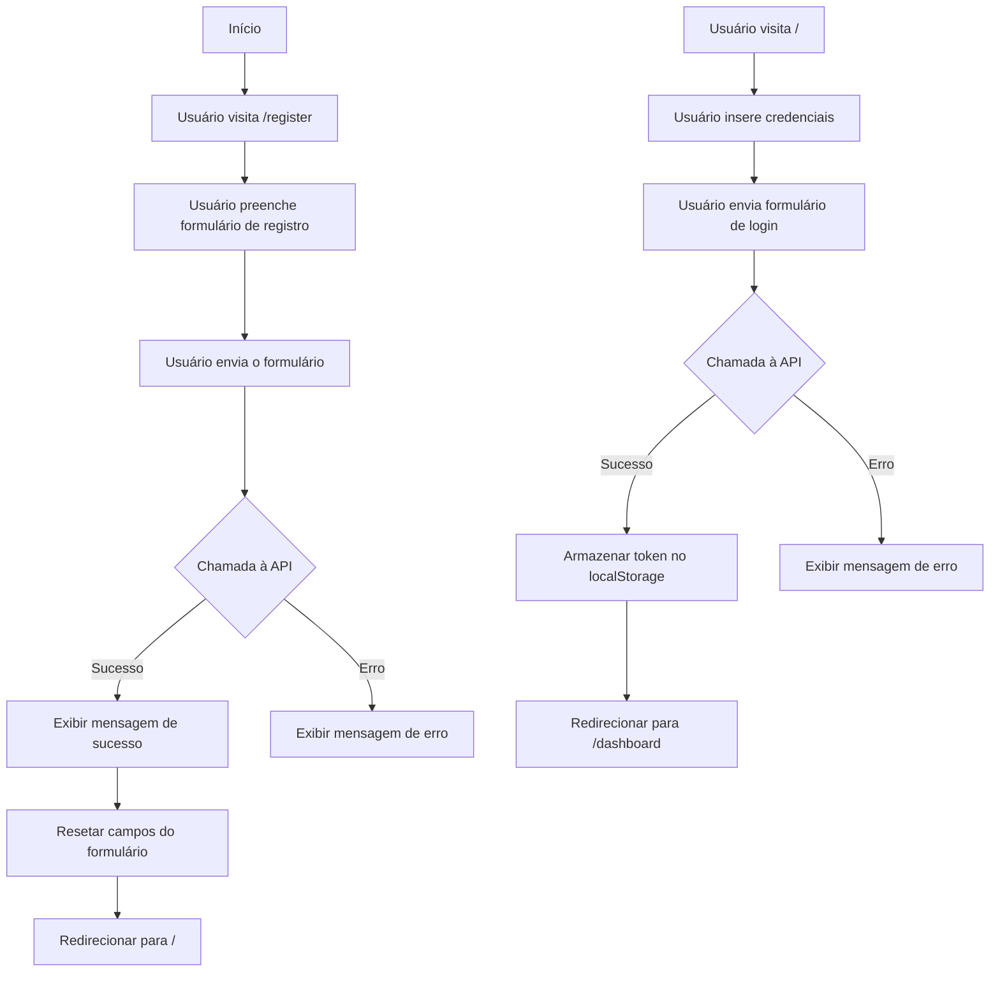
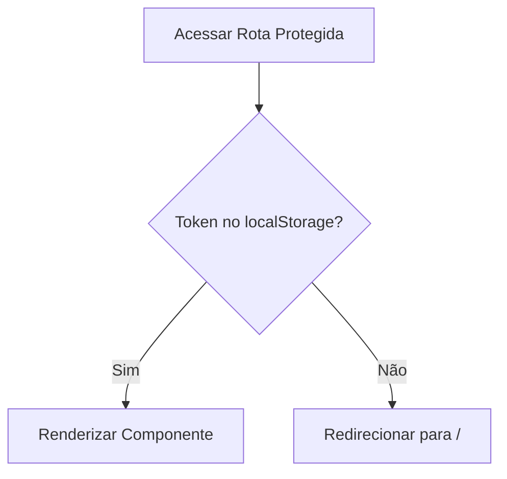
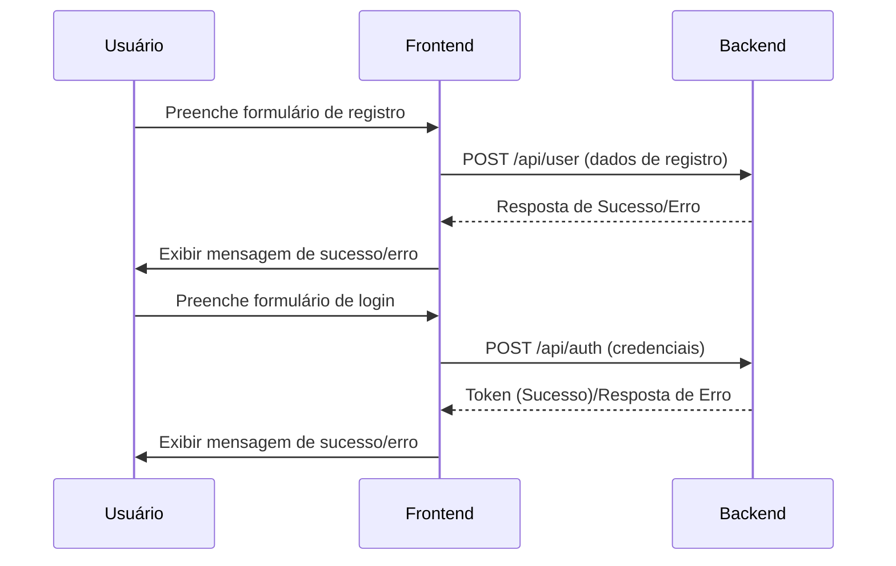

Claro! Aqui está o README atualizado com informações sobre o autor e a licença:

---

# Frontend de Cadastro de Usuário e Gestão de Estoque

Este é o frontend de uma aplicação de cadastro de usuário e gestão de estoque construída com React. Ele possui funcionalidades de registro de usuário, login e rotas protegidas para acesso a recursos de gestão de estoque.

## Índice

- [Funcionalidades](#funcionalidades)
- [Tecnologias Utilizadas](#tecnologias-utilizadas)
- [Estrutura do Projeto](#estrutura-do-projeto)
- [Começando](#começando)
- [Uso](#uso)
- [Interação com a API](#interação-com-a-api)
- [Diagramas](#diagramas)
- [Autor](#autor)
- [Licença](#licença)

## Funcionalidades

- Cadastro de usuário com email e senha.
- Funcionalidade de login.
- Rotas protegidas para acessar funcionalidades do painel.
- Design responsivo.

## Tecnologias Utilizadas

- React
- TypeScript
- Axios
- React Router
- Bootstrap (para estilização)

## Estrutura do Projeto

A estrutura do projeto está organizada da seguinte forma:



## Começando

Para obter uma cópia local e colocá-la em funcionamento, siga estes passos:

1. **Clone o repositório:**

   ```bash
   git clone https://github.com/RafaelRodrigues44/stockManagementFront.git

2. **Navegue até o diretório do projeto:**

   ```bash
   cd stockmanager
   ```

3. **Instale as dependências:**

   ```bash
   npm i
   ```

4. **Inicie o servidor de desenvolvimento:**

   ```bash
   npm start
   ```

   Abra seu navegador e vá para `http://localhost:3000`.

## Uso

- **Cadastro:**
  - Navegue até `/register` para criar uma nova conta de usuário.
  - Preencha o formulário e envie.

- **Login:**
  - Acesse o caminho raiz `/` para fazer login.
  - Insira suas credenciais e envie o formulário.

- **Acessar o Painel:**
  - Após o login bem-sucedido, você será redirecionado para `/dashboard`, onde poderá gerenciar o estoque.

O frontend se comunica com a API backend para registro e autenticação de usuários, além de outras funcionalidades de gestão de estoque. Abaixo estão as principais interações com a API:

- Cadastro de Usuário:

    - Endpoint: POST /api/user
    - Payload: { name, email, password }
    - Resposta: Mensagem de sucesso ou erro.

- Login de Usuário:
    - Endpoint: POST /api/auth
    - Payload: { email, password }
    - Resposta: Token JWT em caso de sucesso.

- Obter Estoque:
    - Endpoint: GET /api/stock
    - Headers: Authorization: Bearer <token>
    - Resposta: Lista de itens em estoque.

- Adicionar Item ao Estoque:
    - Endpoint: POST /api/stock
    - Headers: Authorization: Bearer <token>
    - Payload: { name, quantity, price }
    - Resposta: Mensagem de sucesso ou erro.

- Atualizar Item no Estoque:
    - Endpoint: PUT /api/stock/:id
    - Headers: Authorization: Bearer <token>
    - Payload: { name, quantity, price }
    - Resposta: Mensagem de sucesso ou erro.

- Remover Item do Estoque:
    - Endpoint: DELETE /api/stock/:id
    - Headers: Authorization: Bearer <token>
    - Resposta: Mensagem de sucesso ou erro.

- Obter Detalhes de um Item:
    - Endpoint: GET /api/stock/:id
    - Headers: Authorization: Bearer <token>
    - Resposta: Detalhes do item específico em estoque.

## Diagramas

### Diagrama de Fluxo para Cadastro de Usuário e Login



### Lógica de Rota Protegida



### Diagrama de Interação com a API



## Autor

- Desenvolvido por Rafael Rodrigues

  rafael.rodrigues85@hotmail.com

## Direitos de Uso

Este software é fornecido "como está" e não deve ser utilizado para fins comerciais. A redistribuição ou modificação deste software sem autorização prévia é proibida.

